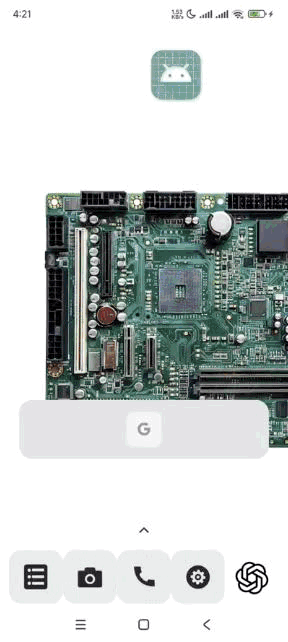

# Movie Lister

A fast-written React Native app that fetches movies from OMDB and displays them in a list.

## Features

- **Search Movies:** Type a title in the search bar.
- **Debounced API Call:** Uses a custom `useDebounce` hook to delay API requests.
- **Data Fetching:** Custom `useFetchData` hook handles API calls and state.
- **Movie Display:** Renders movies with the `MovieListTile` component.
- **Error Handling:** Displays errors via Alert (can be switched to Modal).

## Tech Stack

- React Native
- Custom Hooks (`useFetchData`, `useDebounce`)
- OMDB API via `react-native-config` for API key management

## Setup

1. **Install dependencies:**  
   Run: `npm install`

2. **Set API Key:**

   - Create a `.env` file at the project root with the following content:  
     `KEY=your_omdb_api_key`
   - Add `.env` to `.gitignore`.

3. **iOS Setup:**

   - Run: `cd ios && pod install && cd ..`
   - Then run: `npx react-native run-ios`

4. **Android Setup:**  
   Run: `npx react-native run-android`

## Code Overview

- **App.tsx:**

  - Uses `useDebounce` to delay search input changes.
  - Calls `useFetchData` with the debounced search key.
  - Renders the search input, loader, error message, or movie list.

- **useFetchData:**

  - Fetches data from OMDB.
  - Manages `data`, `error`, and `loading` states.

- **useDebounce:**

  - Delays value updates to reduce API calls.

- **MovieListTile:**
  - Displays the movie poster and details.

## Note

This code is written fast – expect to clean up and refactor later!
